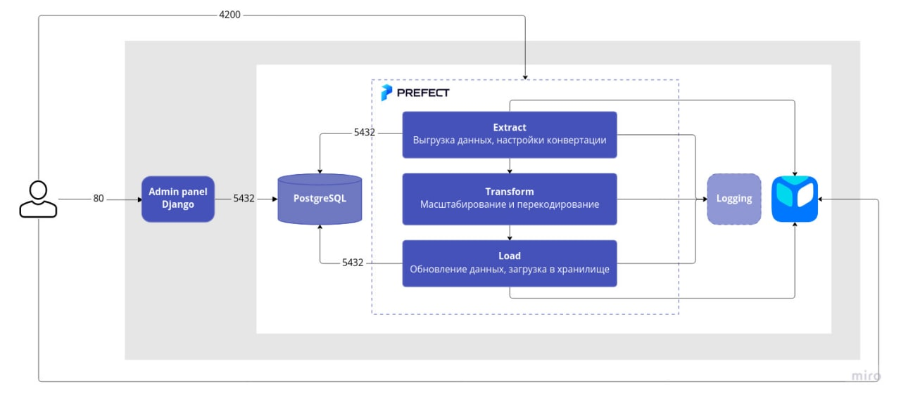

# ETL video-encoding
https://github.com/petr777/graduate_work

#### Start
```bash
make start
```

#### Stop
```bash
make stop
```

#### Deploy Flow
Изменить настроки ``flow`` можно тут ```deploy/video_encoding.yaml```

```
parameters: {
  "etl_schema":{
    'destination_folder': 'rutube',
    'convert_schema': {
      "size": "1920x1080", "vcodec": "libx264", "acodec": "aac"}
  }
}
```
после чего необходимо выполнить команду.
```bash
make apply-deploy
```

#### Worker
```bash
make agent-start
```

#### Other
Другие команды можно посмотреть в Makefile
